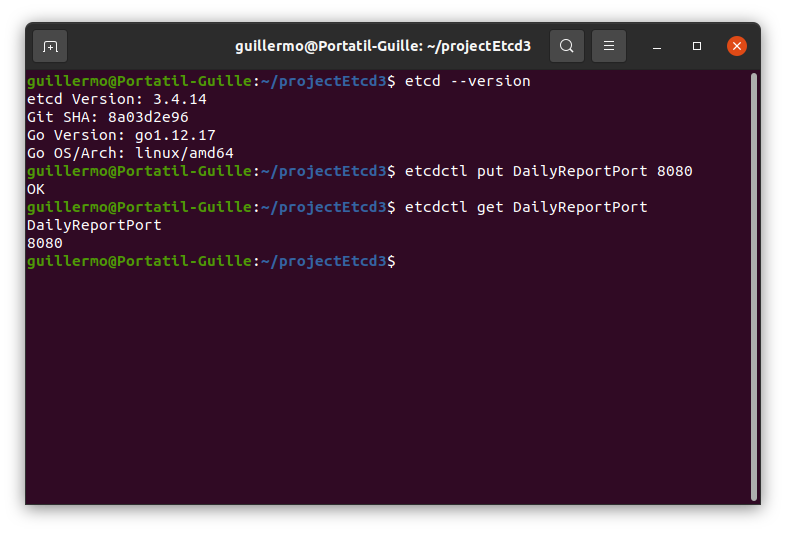
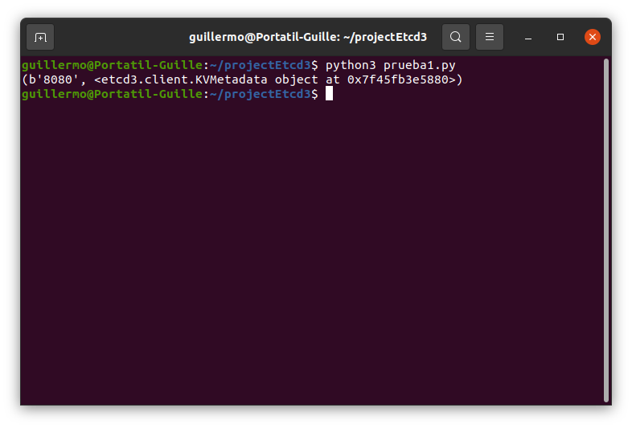
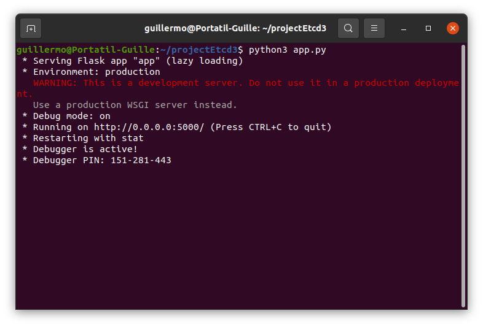
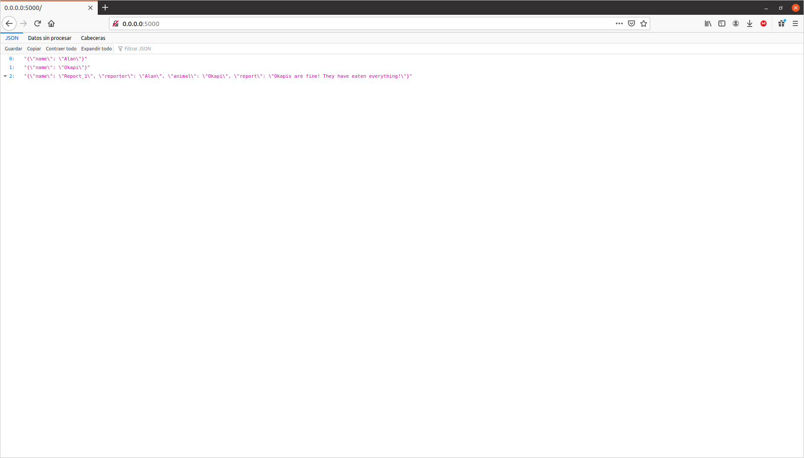
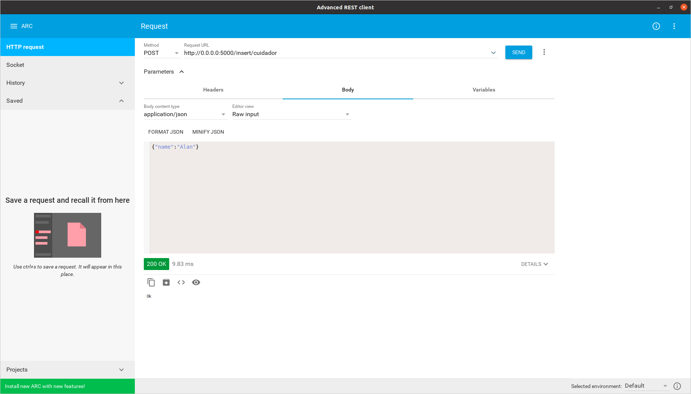
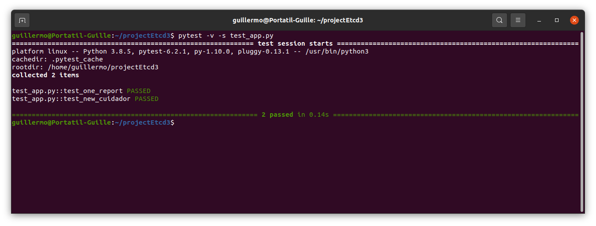
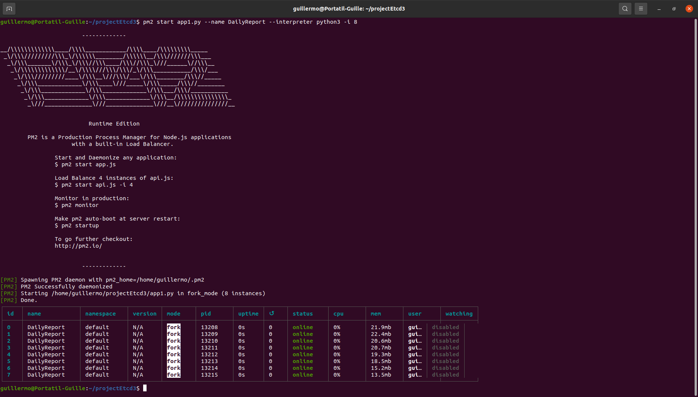
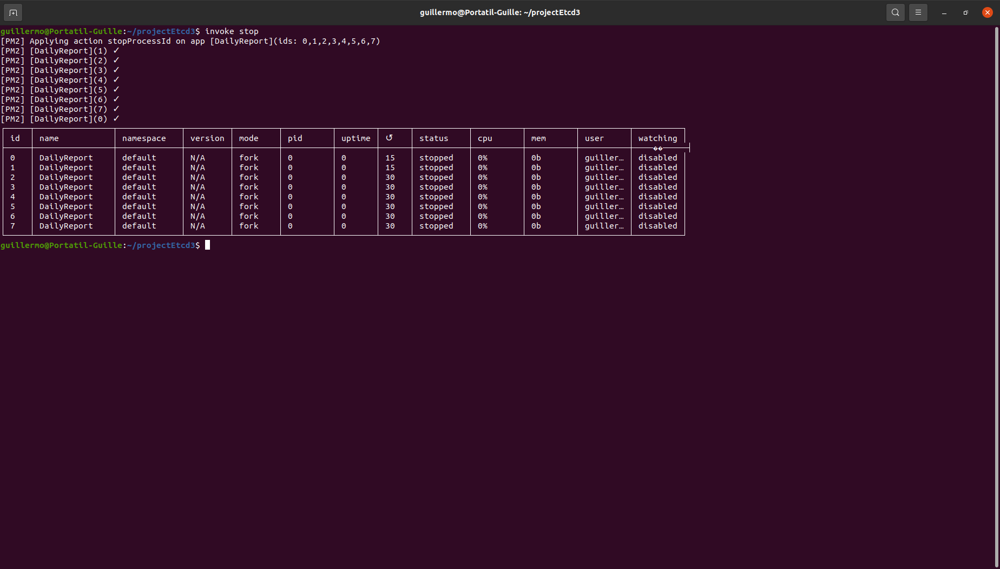

## Ejercicio 1
> Instalar etcd3, averiguar qué bibliotecas funcionan bien con el lenguaje que estemos escribiendo el proyecto (u otro lenguaje), y hacer un pequeño ejemplo de almacenamiento y recuperación de una clave; hacer el almacenamiento desde la línea de órdenes (con etcdctl) y la recuperación desde el mini-programa que hagáis.

Después de instalar etcd3 y etcdctl, se ha probado. EL resultado ha sido el siguiente:




 Se ha hecho el siguiente [programa](https://github.com/Guillergood/Ejercicios_20-21_CC/tree/main/Ejercicios%20Tema%205/prueba1.py) para probar:

```python
import etcd3
import sys

if __name__ == "__main__":
	etcd = etcd3.client()
	print(etcd.get('DailyReportPort'))

```

El resultado de ejecutarlo con ```python3 prueba1.py``` es:



## Ejercicio 2
>Realizar una aplicación básica que use algún microframework para devolver alguna estructura de datos del modelo que se viene usando en el curso u otra que se desee. La intención de este ejercicio es simplemente que se vea el funcionamiento básico de un microframework, especialmente si es alguno que, como express, tiene un generador de código. Se puede usar, por otro lado, el lenguaje y microframework que se desee.

Para realizar el ejercicio se ha escogido el programa hecho en el tema anterior con Flask y Python. Aquí se puede ver el [programa](https://github.com/Guillergood/Ejercicios_20-21_CC/tree/main/Ejercicios%20Tema%205/app.py) :

```python
from flask import Flask, jsonify
import json
app = Flask(__name__)

@app.route('/')
def home():
	cuidador = json.dumps({"name": "Alan"})
	animal = json.dumps({"name": "Okapi"})
	report = json.dumps({"name": "Report_1", "reporter": "Alan", "animal": "Okapi", "report": "Okapis are fine! They have eaten everything!"})

	return jsonify([cuidador, animal, report]), 200

if __name__ == '__main__':
    app.run(debug=True, host='0.0.0.0')
```

Cuya ejecución se muestra a continuación:



En la dirección ```http://0.0.0.0:5000/``` se obtiene los siguientes valores:



## Ejercicio 3
> Programar un microservicio en express (o el lenguaje y marco elegido) que incluya variables como en el caso anterior.

Para añadirle alguna funcionalidad más al programa, se le ha registrado una ruta para introducir mediante el verbo HTTP POST un cuidador, el programa se encuentra [aquí](https://github.com/Guillergood/Ejercicios_20-21_CC/tree/main/Ejercicios%20Tema%205/app.py) :

```python
from flask import Flask, jsonify, request
import json
app = Flask(__name__)

def define_routes(app):
	@app.route('/')
	def home():
		cuidador = json.dumps({"name": "Alan"})
		animal = json.dumps({"name": "Okapi"})
		report = json.dumps({"name": "Report_1", "reporter": "Alan", "animal": "Okapi", "report": "Okapis are fine! They have eaten everything!"})

		return jsonify([cuidador, animal, report]), 200
		
	@app.route('/insert/cuidador', methods=['POST'])
	def insert_cuidador():
		data_string = request.get_data()
		data = json.loads(data_string)
		
		cuidador_name = data.get('name')


		if cuidador_name:
			return 'Ok', 200
		else:
			return 'Error', 400
		
if __name__ == '__main__':
    app.run(debug=True, host='0.0.0.0')
```
Para ver cómo reacciona, se ha utilizado el plugin Advanced REST client de Chrome:



## Ejercicio 4
> Crear pruebas para las diferentes rutas de la aplicación.

Para realizar pruebas con el código se realizará con Pytest, como se ha hecho en el curso TDD. El archivo de las pruebas está [aquí](https://github.com/Guillergood/Ejercicios_20-21_CC/tree/main/Ejercicios%20Tema%205/test_app.py)

```python
from flask import Flask
import json
import pytest

from app1 import define_routes

# Comprueba que existe el report_1
def test_one_report():
    app = Flask(__name__)
    define_routes(app)
    client = app.test_client()
    url = '/'

    response = client.get(url)
    
    # Asegurar el código recibido es OK
    assert response.status_code == 200
    
    data = response.get_data()
    all_entries = json.loads(data)
    reports = json.loads(all_entries[2]);
    # Asegurar que Report_1 existe
    assert 'Report_1' in [reports['name']]
    
# Comprueba que inserta un nuevo cuidador
def test_new_cuidador():
	app = Flask(__name__)
	define_routes(app)
	client = app.test_client()
	url = '/insert/cuidador'
	
	new_cuidador = {
		'name': 'David'
	}
	
	response = client.post(url, data = json.dumps(new_cuidador))
	assert response.status_code == 200
```

Y pasan los test:



## Ejercicio 5
> Experimentar con diferentes gestores de procesos y servidores web front-end para un microservicio que se haya hecho con antelación, por ejemplo en la sección anterior.

Para este ejercicio se han estudiado las siguientes opciones:

* **PM2**.
* **Shovel (implementación de rake en Python)**.

Y se ha elegido PM2. Una vez instalado, se procede a iniciar las aplicaciones con la orden ```pm2 start app2.py --name DailyReport --interpreter python3 -i 8```, para ejecutar con Python 8 instancias de ello.




## Ejercicio 6
> Usar rake, invoke o la herramienta equivalente en tu lenguaje de programación para programar diferentes tareas que se puedan lanzar fácilmente desde la línea de órdenes.

Se va a proceder a utilizar invoke [aquí](https://github.com/Guillergood/Ejercicios_20-21_CC/tree/main/Ejercicios%20Tema%205/tasks.py):

```python
from invoke import task, run

@task 
def start(context):
	run("pm2 start app1.py --name DailyReport --interpreter python3 -i 8")
@task 
def stop(context):
	run("pm2 stop DailyReport")
```

Como ejemplo se invoca la tarea stop:



